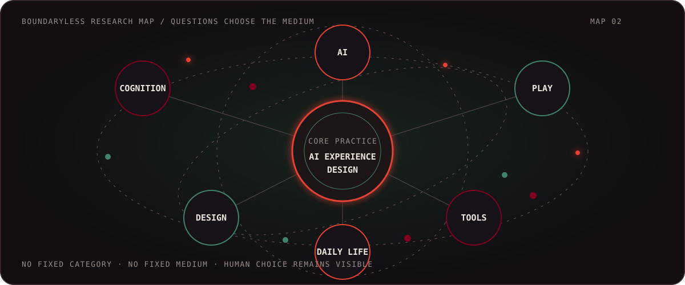

<div align="center">
  

  <h1>BUM-BOO · AI DESIGN LAB</h1>
  <p><strong>Designing AI experiences that make everyday life lighter, clearer, and more playful.</strong></p>
  <p>AI experience design · Human-centered automation · Boundaryless research</p>

  <a href="docs/readme/README.en.md">English</a> ·
  <a href="docs/readme/README.ko.md">한국어</a> ·
  <a href="docs/readme/README.zh-CN.md">简体中文</a> ·
  <a href="docs/readme/README.ja.md">日本語</a>

  <br /><br />

  
  
  

  <br />
  
</div>

---

## The Lab

I want to become an **AI designer**: someone who explores, designs, and builds useful AI experiences—not only for developers, but for anyone whose day could become easier or more enjoyable.

I move freely across design, cognition, technology, media, and unfamiliar fields. The medium is never fixed. A desktop utility, an agent workflow, a local archive, a controller, or a small interface can all become ways to improve an everyday experience.

> **My question is simple:** how can AI help people feel more capable, less burdened, and a little more delighted in ordinary life?

<div align="center">
  
</div>

<table>
  <tr>
    <td width="33%"><strong>EXPLORE</strong><br />Follow questions across disciplines without treating existing categories as walls.</td>
    <td width="33%"><strong>DESIGN</strong><br />Turn complex systems into visible, understandable, human-scale experiences.</td>
    <td width="33%"><strong>BUILD</strong><br />Prototype real tools, test their boundaries, and keep what genuinely helps.</td>
  </tr>
</table>

## Current Research Threads

- AI experience design for people without a development background
- Cognition, learning, attention, and the ways tools reshape everyday behavior
- Review-before-write agents that keep humans in control
- Local-first systems for private, durable, and reversible work
- Playful interfaces that make serious tools less intimidating
- Cross-disciplinary experiments without a fixed medium or product category

<div align="center">
  
</div>

## Selected Experiments

<table>
  <tr>
    <td width="50%" valign="top">
      <h3><a href="https://github.com/Bum-Boo/hermes-skill-library">Hermes Skill Library</a></h3>
      <p>A growing collection of reusable skills for turning Hermes Agent into a practical, grounded collaborator.</p>
      <p><code>agent design</code> <code>workflow research</code> <code>toolmaking</code></p>
    </td>
    <td width="50%" valign="top">
      <h3><a href="https://github.com/Bum-Boo/BIGLOADER-with-Ai-agent">BIGLOADER with AI Agent</a></h3>
      <p>A Windows Instagram collector and local media workspace designed for useful, non-developer-friendly content operations.</p>
      <p><code>everyday utility</code> <code>local-first</code> <code>AI workflow</code></p>
    </td>
  </tr>
  <tr>
    <td width="50%" valign="top">
      <h3><a href="https://github.com/Bum-Boo/agent-change-gate">Agent Change Gate</a></h3>
      <p>A review-before-write interface that makes AI changes inspectable, scoped, and reversible.</p>
      <p><code>human control</code> <code>Obsidian</code> <code>ACP</code></p>
    </td>
    <td width="50%" valign="top">
      <h3><a href="https://github.com/Bum-Boo/hermes-desktop-korean">Hermes Desktop Korean</a></h3>
      <p>A complete Korean localization effort backed by automated coverage and type verification.</p>
      <p><code>accessibility</code> <code>localization</code> <code>Hermes</code></p>
    </td>
  </tr>
</table>

<details>
<summary><strong>More tools from the workshop</strong></summary>

- [BBCC](https://github.com/Bum-Boo/BBCC) — controller shortcuts for creative and media workflows
- [BTS Sec](https://github.com/Bum-Boo/BTS_sec) — defensive auditing for authorized projects
- [Hermes ComfyUI Maker](https://github.com/Bum-Boo/hermes-comfyui-maker) — image workflows through conversational agents
- [Vaultwright](https://github.com/Bum-Boo/Vaultwright) — local-first Obsidian maintenance
- [BB TxT](https://github.com/Bum-Boo/BBTxT) — fast local text search
- [Bumboo Build Inspector](https://github.com/Bum-Boo/bumboo-build-inspector) — structured review for rapidly built software

</details>

## Tools on the Workbench

<div align="center">
  
  <br /><br />
  
  
  
  
</div>

<p align="center"><em>Tools are materials, not identity. I choose them according to the experience I want to create.</em></p>

## Lab Signals

<div align="center">
  
</div>

<div align="center">
  
  
</div>

<div align="center">
  
</div>

<div align="center">
  
</div>

## Studio Principles

```text
LOCAL FIRST       Keep personal data close to the person who owns it.
REVIEW BEFORE WRITE  Make changes visible before they become durable.
REVERSIBLE BY DESIGN  Prefer drafts, branches, backups, and clear exits.
OPEN-ENDED RESEARCH   Let the question choose the discipline and medium.
EVERYDAY DELIGHT      Serious technology can still feel playful and humane.
```

<div align="center">
  <h3>Still exploring. Still prototyping. Still crossing boundaries.</h3>
  <p><a href="https://bumboo.fun">bumboo.fun</a></p>
</div>
