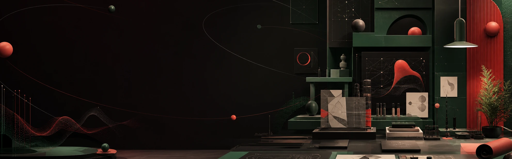
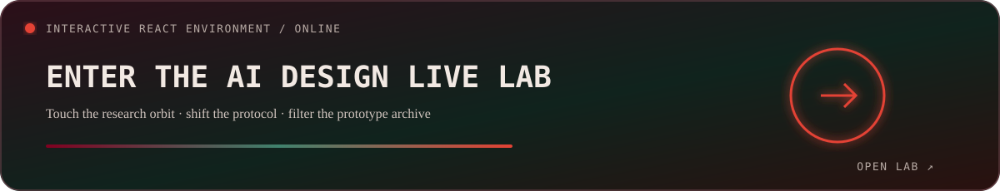
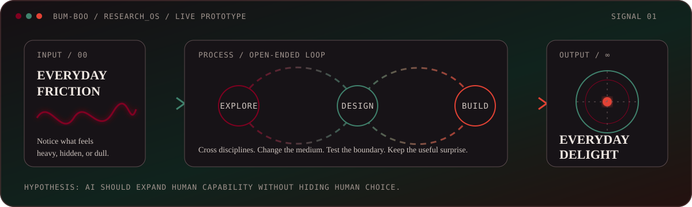
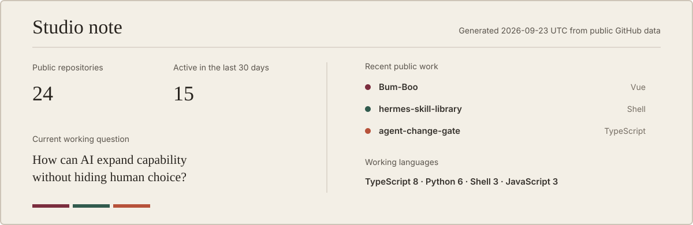

# Bum-Boo

  

I’m building a practice in **AI experience design**: making AI useful beyond developer tools, while keeping its state, scope, and consequences understandable to the people using it.

My work moves between design, cognition, technology, media, and everyday routines. A desktop utility, an agent workflow, a local archive, a controller, or a small interface can all become ways to make an ordinary experience lighter and more capable.

[**Enter the Live Lab →**](https://bum-boo.github.io/Bum-Boo/) · [한국어](docs/readme/README.ko.md) · [日本語](docs/readme/README.ja.md) · [简体中文](docs/readme/README.zh-CN.md)

## The lab

I tend to begin with friction that is easy to overlook: a change that cannot be reviewed, a folder that has become unmanageable, a language barrier, or a repeated action that should take one button.

> **The recurring question:** how can AI help people feel more capable without making human choice disappear?

## Current research threads

- AI experience design for people without a development background
- Cognition, development, learning, attention, and the ways tools reshape behavior
- Review-before-write agents that keep human decisions visible
- Local-first systems for private, durable, and reversible work
- Playful interfaces that make serious tools less intimidating
- Cross-disciplinary experiments without a fixed medium or product category

<strong>Open lab notebook — hypotheses, tensions, and unfinished questions</strong>

### Active hypotheses

- AI becomes more useful when its state, scope, and uncertainty stay visible.
- Non-developers do not need simplified intelligence; they need better interaction contracts.
- A playful interface can reduce fear without hiding operational seriousness.
- Local-first architecture is not only privacy infrastructure; it is an experience-design choice.

### Productive tensions

| Tension | What I am exploring |
|---|---|
| Automation ↔ agency | How much should happen automatically before control becomes invisible? |
| Intelligence ↔ legibility | Can a powerful system still explain what it is doing in human-scale terms? |
| Utility ↔ delight | Can a serious workflow feel playful without becoming distracting? |
| Breadth ↔ coherence | How can open-ended exploration still produce focused, useful artifacts? |

### Unfinished questions

- What does an AI interface look like when conversation is only one material among many?
- How can tools support cognitive growth instead of replacing effort indiscriminately?
- Which everyday frustrations are small enough to overlook but meaningful enough to redesign?

## Selected experiments

<table>
  <tr>
    <td width="50%" valign="top">
      
      <h3><a href="https://github.com/Bum-Boo/hermes-skill-library">Hermes Skill Library</a></h3>
      
Reusable skills for turning Hermes Agent into a practical collaborator with explicit scope and grounded procedures.

    </td>
    <td width="50%" valign="top">
      
      <h3><a href="https://github.com/Bum-Boo/BIGLOADER-with-Ai-agent">BIGLOADER with AI Agent</a></h3>
      
A Windows media workspace designed for useful content operations without requiring a developer-facing pipeline.

    </td>
  </tr>
  <tr>
    <td width="50%" valign="top">
      
      <h3><a href="https://github.com/Bum-Boo/agent-change-gate">Agent Change Gate</a></h3>
      
A review-before-write interface that makes agent changes inspectable, scoped, and reversible.

    </td>
    <td width="50%" valign="top">
      
      <h3><a href="https://github.com/Bum-Boo/hermes-desktop-korean">Hermes Desktop Korean</a></h3>
      
Korean localization treated as access design, backed by automated coverage and type verification.

    </td>
  </tr>
  <tr>
    <td width="50%" valign="top">
      
      <h3><a href="https://github.com/Bum-Boo/BBCC">BBCC</a></h3>
      
Controller shortcuts that turn repeated creative and media actions into physical memory.

    </td>
    <td width="50%" valign="top">
      
      <h3><a href="https://github.com/Bum-Boo/BTS_sec">BTS Sec</a></h3>
      
Defensive review utilities for web and local projects that are explicitly authorized.

    </td>
  </tr>
</table>

<strong>More tools from the workshop</strong>

- [Hermes ComfyUI Maker](https://github.com/Bum-Boo/hermes-comfyui-maker) — image workflows through conversational agents
- [Vaultwright](https://github.com/Bum-Boo/Vaultwright) — local-first Obsidian maintenance
- [BB TxT](https://github.com/Bum-Boo/BBTxT) — fast local text search
- [Bumboo Build Inspector](https://github.com/Bum-Boo/bumboo-build-inspector) — structured review for rapidly built software

## Working materials

Python, TypeScript, JavaScript, Node.js, Electron, PowerShell, GitHub Actions, Obsidian, Hermes Agent, MCP, and ComfyUI. I choose them according to the experience and constraints of the work; the tool list is not the identity of the practice.

## Studio note

The panel below is generated from public repository data. It shows a small factual snapshot rather than a score, streak, or productivity claim.

## Working principles

- **Local first.** Keep personal workflow data close to the person who owns it.
- **Review before write.** Make changes visible before they become durable.
- **Reversible by design.** Prefer drafts, branches, backups, and clear exits.
- **Open-ended research.** Let the question choose the discipline and medium.
- **Everyday delight.** Serious technology can still feel playful and humane.

---

Still exploring, prototyping, and crossing boundaries. More finished work and notes live at [bumboo.fun](https://bumboo.fun).
